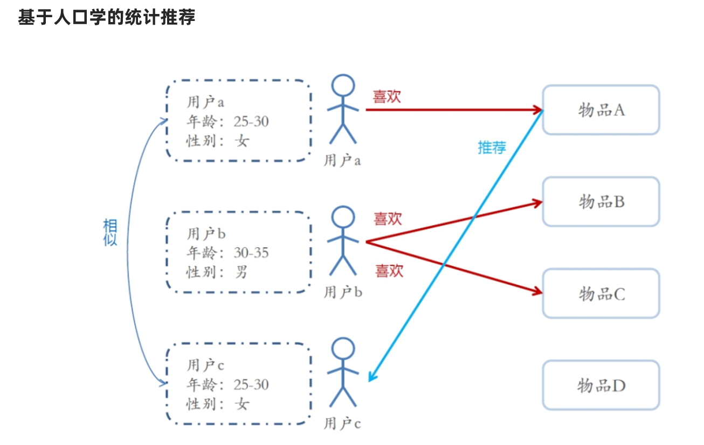

# Spark综合案例-概述

## 流程分析


注意: 

我们重点做的 2 3 4 部分

其他部分直接使用, 后续看时间再补充说明推荐算法


## 业务模块划分


# 准备工作

## 创建模块包结构

## 导入相关代码


## 准备Kafka主题

```
#查看topic信息
/export/server/kafka/bin/kafka-topics.sh --list --zookeeper node1:2181

#删除topic
/export/server/kafka/bin/kafka-topics.sh --delete --zookeeper node1:2181 --topic edu

#创建topic
/export/server/kafka/bin/kafka-topics.sh --create --zookeeper node1:2181 --replication-factor 1 --partitions 3 --topic edu

#模拟消费者
/export/server/kafka/bin/kafka-console-consumer.sh --bootstrap-server node1:9092 --topic edu --from-beginning
```


## 测试发送数据到Kafka

启动


```json
{
    "student_id":"学生ID_31",
    "textbook_id":"教材ID_1",
    "grade_id":"年级ID_6",
    "subject_id":"科目ID_2_语文",
    "chapter_id":"章节ID_chapter_3",
    "question_id":"题目ID_1003",
    "score":7,
    "answer_time":"2021-01-09 14:53:28",
    "ts":"Jan 9, 2021 2:53:28 PM"
}
```


# 学生答题情况实时分析

## 需求


## 代码实现

```java
package cn.itcast.edu.analysis.streaming

import cn.itcast.edu.bean.Answer
import com.google.gson.Gson
import org.apache.spark.SparkContext
import org.apache.spark.sql.{DataFrame, Dataset, Row, SparkSession}

/**
 * Author itcast
 * Desc 实时的从Kafka的edu主题消费数据,并做实时的统计分析,结果可以直接输出到控制台或mysql
 */
object StreamingAnalysis {
  def main(args: Array[String]): Unit = {
    //TODO 0.准备环境
    val spark: SparkSession = SparkSession.builder().appName("StreamingAnalysis").master("local[*]")
      .config("spark.sql.shuffle.partitions", "4")//本次测试时将分区数设置小一点,实际开发中可以根据集群规模调整大小,默认200
      .getOrCreate()
    val sc: SparkContext = spark.sparkContext
    sc.setLogLevel("WARN")
    import spark.implicits._
    import org.apache.spark.sql.functions._

    //TODO 1.加载数据
    val kafkaDF: DataFrame = spark.readStream
      .format("kafka")
      .option("kafka.bootstrap.servers", "node1:9092")
      .option("subscribe", "edu")
      .load()
    val valueDS: Dataset[String] = kafkaDF.selectExpr("CAST(value AS STRING)").as[String]
    //{"student_id":"学生ID_31","textbook_id":"教材ID_1","grade_id":"年级ID_6","subject_id":"科目ID_2_语文","chapter_id":"章节ID_chapter_3","question_id":"题目ID_1003","score":7,"answer_time":"2021-01-09 14:53:28","ts":"Jan 9, 2021 2:53:28 PM"}

    //TODO 2.处理数据
    //---数据预处理
    //解析json-方式1:
    /*valueDS.select(
      get_json_object($"value", "$.student_id").as("student_id"),
      //.....
    )*/
    //解析json-方式2:将每一条json字符串解析为一个样例类对象
    val answerDS: Dataset[Answer] = valueDS.map(josnStr => {
      val gson = new Gson()
      //json--->对象
      gson.fromJson(josnStr, classOf[Answer])
    })
   //---实时分析
    //TODO ==实时分析需求1:统计top10热点题
    //SQL
    /*
    val result1 = spark.sql(
    """SELECT
      |  question_id, COUNT(1) AS frequency
      |FROM
      |  t_answer
      |GROUP BY
      |  question_id
      |ORDER BY
      |  frequency
      |DESC
      |LIMIT 10
    """.stripMargin)
     */
    //DSL
    val result1: Dataset[Row] = answerDS.groupBy('question_id)
      //.agg(count('question_id) as "count")
      .count()
      .orderBy('count.desc)
      .limit(10)

    //TODO ==实时分析需求2:统计top10答题活跃年级
    /*
    val result2 = spark.sql(
      """SELECT
        |  grade_id, COUNT(1) AS frequency
        |FROM
        |  t_answer
        |GROUP BY
        |  grade_id
        |ORDER BY
        |  frequency
        |DESC
    |LIMIT 10
      """.stripMargin)
     */
    val result2: Dataset[Row] = answerDS.groupBy('grade_id)
      .count()
      .orderBy('count.desc)
      .limit(10)

    //TODO ==实时分析需求3:统计top10热点题并带上所属科目
    /*
    注意:select...group语句下,select 后面的字段要么是分组字段,要么是聚合字段
    val result1 = spark.sql(
    """SELECT
      |  question_id,first(subject_id), COUNT(1) AS frequency
      |FROM
      |  t_answer
      |GROUP BY
      |  question_id
      |ORDER BY
      |  frequency
      |DESC
      |LIMIT 10
    """.stripMargin)
     */
    val result3: Dataset[Row] = answerDS.groupBy('question_id)
      .agg(
        first('subject_id) as "subject_id",
        count('question_id) as "count"
      )
      .orderBy('count.desc)
      .limit(10)

    //TODO ==实时分析需求4:统计每个学生的得分最低的题目top10并带上是所属哪道题
    /*
    val result4 = spark.sql(
      """SELECT
        |  student_id, FIRST(question_id), MIN(score)
        |FROM
        |  t_answer
        |GROUP BY
        |  student_id
    |order by
    |  score
    |limit 10
      """.stripMargin)
     */
    val result4: Dataset[Row] = answerDS.groupBy('student_id)
      .agg(
        min('score) as "minscore",
        first('question_id)
      )
      .orderBy('minscore)
      .limit(10)


    //TODO 3.输出结果
    result1.writeStream
      .format("console")
      .outputMode("complete")
      .start()
    result2.writeStream
      .format("console")
      .outputMode("complete")
      .start()
    result3.writeStream
      .format("console")
      .outputMode("complete")
      .start()
    result4.writeStream
      .format("console")
      .outputMode("complete")
      //TODO 4.启动并等待结束
      .start()
      .awaitTermination()

    //TODO 5.关闭资源
    spark.stop()
  }
}

```


# 实时推荐易错题

## 需求


## 准备模型-直接训练并使用


## 代码实现

```java
package cn.itcast.edu.analysis.streaming

import cn.itcast.edu.bean.Answer
import cn.itcast.edu.utils.RedisUtil
import com.google.gson.Gson
import org.apache.kafka.clients.consumer.ConsumerRecord
import org.apache.kafka.common.serialization.StringDeserializer
import org.apache.spark.ml.recommendation.ALSModel
import org.apache.spark.{SparkContext, streaming}
import org.apache.spark.sql.{DataFrame, SaveMode, SparkSession}
import org.apache.spark.streaming.dstream.{DStream, InputDStream}
import org.apache.spark.streaming.kafka010.{ConsumerStrategies, KafkaUtils, LocationStrategies}
import org.apache.spark.streaming.{Seconds, StreamingContext}
import redis.clients.jedis.Jedis

/**
 * Author itcast
 * Desc
 * 从Kafka消费消息(消息中有用户id),
 * 然后从Redis中获取推荐模型的路径,并从路径中加载推荐模型ALSModel
 * 然后使用该模型给用户推荐易错题
 */
object StreamingRecommend {
  def main(args: Array[String]): Unit = {
    //TODO 0.准备环境
    val spark: SparkSession = SparkSession.builder().appName("StreamingAnalysis").master("local[*]")
      .config("spark.sql.shuffle.partitions", "4") //本次测试时将分区数设置小一点,实际开发中可以根据集群规模调整大小,默认200
      .getOrCreate()
    val sc: SparkContext = spark.sparkContext
    sc.setLogLevel("WARN")
    val ssc: StreamingContext = new StreamingContext(sc, streaming.Seconds(5))
    import spark.implicits._
    import org.apache.spark.sql.functions._

    //TODO 1.加载数据
    val kafkaParams = Map[String, Object](
      "bootstrap.servers" -> "node1:9092", //kafka集群地址
      "key.deserializer" -> classOf[StringDeserializer], //key的反序列化规则
      "value.deserializer" -> classOf[StringDeserializer], //value的反序列化规则
      "group.id" -> "StreamingRecommend", //消费者组名称
      "auto.offset.reset" -> "latest",
      "auto.commit.interval.ms" -> "1000", //自动提交的时间间隔
      "enable.auto.commit" -> (true: java.lang.Boolean) //是否自动提交
    )
    val topics = Array("edu") //要订阅的主题
    val kafkaDStream: InputDStream[ConsumerRecord[String, String]] = KafkaUtils.createDirectStream[String, String](ssc,
      LocationStrategies.PreferConsistent,
      ConsumerStrategies.Subscribe[String, String](topics, kafkaParams)
    )

    //TODO 2.处理数据
    val valueDStream: DStream[String] = kafkaDStream.map(record => {
      record.value()
    })
    //{"student_id":"学生ID_47","textbook_id":"教材ID_1","grade_id":"年级ID_3","subject_id":"科目ID_3_英语","chapter_id":"章节ID_chapter_3","question_id":"题目ID_534","score":7,"answer_time":"2021-01-09 15:29:50","ts":"Jan 9, 2021 3:29:50 PM"}
    valueDStream.foreachRDD(rdd => {
      if (!rdd.isEmpty()) {

        //该rdd表示每个微批的数据
        //==1.获取path并加载模型
        //获取redis连接
        val jedis: Jedis = RedisUtil.pool.getResource
        //加载模型路径
        // jedis.hset("als_model", "recommended_question_id", path)
        val path: String = jedis.hget("als_model", "recommended_question_id")
        //根据路径加载模型
        val model: ALSModel = ALSModel.load(path)

        //==2.取出用户id
        val answerDF: DataFrame = rdd.coalesce(1).map(josnStr => {
          val gson = new Gson()
          gson.fromJson(josnStr, classOf[Answer])
        }).toDF
        //将用户id转为数字,因为后续模型推荐的时候需要数字格式的id
        val id2int = udf((student_id: String) => {
          student_id.split("_")(1).toInt
        })
        val studentIdDF: DataFrame = answerDF.select(id2int('student_id) as "student_id")

        //==3.使用模型给用户推荐题目
        val recommendDF: DataFrame = model.recommendForUserSubset(studentIdDF, 10)
        recommendDF.printSchema()
        /*
        root
       |-- student_id: integer (nullable = false) --用户id
       |-- recommendations: array (nullable = true)--推荐列表
       |    |-- element: struct (containsNull = true)
       |    |    |-- question_id: integer (nullable = true)--题目id
       |    |    |-- rating: float (nullable = true)--评分/推荐指数
         */
        recommendDF.show(false)
        /*
     +----------+--------------------------------------------------------------------------------------------------------------------------------------------------------------------------------------------+
    |student_id|recommendations                                                                                                                                                                             |
    +----------+--------------------------------------------------------------------------------------------------------------------------------------------------------------------------------------------+
    |12        |[[1707, 2.900552], [641, 2.8934805], [815, 2.8934805], [1583, 2.8934805], [1585, 2.8774242], [1369, 2.8033295], [906, 2.772558], [2129, 2.668791], [1661, 2.585957], [1978, 2.5290453]]     |
    |14        |[[1627, 2.8925943], [446, 2.8925943], [1951, 2.8925943], [1412, 2.8925943], [1812, 2.8925943], [1061, 2.8816805], [1661, 2.874632], [1453, 2.8682063], [1111, 2.8643343], [1797, 2.7966104]]|
         */
        //处理推荐结果:取出用户id和题目id拼成字符串:"id1,id2,id3..."
        val recommendResultDF: DataFrame = recommendDF.as[(Int, Array[(Int, Float)])].map(t => {
          //val studentId: Int = t._1
          //val studentIdStr: String = "学生ID_"+ studentId
          //val questionIdsAndRating: Array[(Int, Float)] = t._2
          //val questionIds: Array[Int] = questionIdsAndRating.map(_._1)
          //val questionIdsStr: String = questionIds.mkString(",")
          val studentIdStr: String = "学生ID_" + t._1
          val questionIdsStr: String = t._2.map("题目ID_" + _._1).mkString(",")
          (studentIdStr, questionIdsStr)
        }).toDF("student_id", "recommendations")

        //将answerDF和recommendResultDF进行join
        val allInfoDF: DataFrame = answerDF.join(recommendResultDF, "student_id")

        //==4.输出结果到MySQL/HBase
        if (allInfoDF.count() > 0) {
          val properties = new java.util.Properties()
          properties.setProperty("user", "root")
          properties.setProperty("password", "root")
          allInfoDF
            .write
            .mode(SaveMode.Append)
            .jdbc("jdbc:mysql://localhost:3306/edu?useUnicode=true&characterEncoding=utf8", "t_recommended", properties)
        }

        //关闭redis连接
        jedis.close()
      }
    }
    )

    //TODO 3.输出结果

    //TODO 4.启动并等待停止
    ssc.start()
    ssc.awaitTermination()

    //TODO 5.关闭资源
    ssc.stop(stopSparkContext = true, stopGracefully = true) //优雅关闭
  }

}

```


# 学生答题情况离线分析

## 需求


## 代码实现


```java
package cn.itcast.edu.analysis.batch

import breeze.linalg.*
import cn.itcast.edu.bean.AnswerWithRecommendations
import org.apache.spark.SparkContext
import org.apache.spark.sql.{DataFrame, Dataset, Row, SparkSession}

/**
 * Author itcast
 * Desc 离线分析学生学习情况
 */
object BatchAnalysis {
  def main(args: Array[String]): Unit = {
    //TODO 0.准备环境-SparkSession
    val spark: SparkSession = SparkSession.builder().appName("BatchAnalysis").master("local[*]")
      .config("spark.sql.shuffle.partitions", "4")//本次测试时将分区数设置小一点,实际开发中可以根据集群规模调整大小,默认200
      .getOrCreate()
    val sc: SparkContext = spark.sparkContext
    sc.setLogLevel("WARN")
    import spark.implicits._
    import org.apache.spark.sql.functions._

    //TODO 1.加载数据-MySQL
    val properties = new java.util.Properties()
    properties.setProperty("user", "root")
    properties.setProperty("password", "root")
    val allInfoDS: Dataset[AnswerWithRecommendations] = spark.read.jdbc(
      "jdbc:mysql://localhost:3306/edu?useUnicode=true&characterEncoding=utf8",
      "t_recommended",
      properties
    ).as[AnswerWithRecommendations]

    //TODO 2.处理数据/分析数据
    //TODO ===SQL
    //TODO: 需求:1.各科目热点题分析
    // 找到Top50热点题对应的科目，然后统计这些科目中，分别包含这几道热点题的条目数
    /*
    题号 热度
    1    10
    2    9
    3    8
     */
    /*
    题号 热度 科目
    1    10   语文
    2    9    数学
    3    8    数学
     */
    /*
    科目 热点题数量
    语文  1
    数学  2
     */
    //1.统计Top50热点题--子查询t1
    //2.将t1和原始表t_answer关联,并按学科分组聚合统计各个学科包含的热点题的数量
    //==================写法1:SQL风格================
    /*spark.sql(
      """SELECT
        |  subject_id, count(t_answer.question_id) AS hot_question_count
        | FROM
        |  (SELECT
        |    question_id, count(*) AS frequency
        |  FROM
        |    t_answer
        |  GROUP BY
        |    question_id
        |  ORDER BY
        |    frequency
        |  DESC LIMIT
        |    50) t1
        |JOIN
        |  t_answer
        |ON
        |  t1.question_id = t_answer.question_id
        |GROUP BY
        |  subject_id
        |ORDER BY
        |  hot_question_count
        | DESC
  """.stripMargin)
      .show()*/

    //TODO: 需求:2.各科目推荐题分析
    // 找到Top20热点题对应的推荐题目，然后找到推荐题目对应的科目，并统计每个科目分别包含推荐题目的条数
    /*
    科目,包含的推荐的题目的数量
    英语,105
    语文,95
    数学,89
     */
    //1.统计热点题Top20--子查询t1
    //2.将t1和原始表t_answer关联,得到热点题Top20的推荐题列表t2
    //3.用SPLIT将recommendations中的ids用","切为数组,然后用EXPLODE将列转行,并记为t3
    //4.对推荐的题目进行去重,将t3和t_answer原始表进行join,得到每个推荐的题目所属的科目,记为t4
    //5.统计各个科目包含的推荐的题目数量并倒序排序(已去重)
    //==================写法1:SQL风格================
    /*spark.sql(
      """SELECT
        |    t4.subject_id,
        |    COUNT(*) AS frequency
        |FROM
        |    (SELECT
        |        DISTINCT(t3.question_id),
        |        t_answer.subject_id
        |     FROM
        |       (SELECT
        |           EXPLODE(SPLIT(t2.recommendations, ',')) AS question_id
        |        FROM
        |            (SELECT
        |                recommendations
        |             FROM
        |                 (SELECT
        |                      question_id,
        |                      COUNT(*) AS frequency
        |                  FROM
        |                      t_answer
        |                  GROUP BY
        |                      question_id
        |                  ORDER BY
        |                      frequency
        |                  DESC LIMIT
        |                      20) t1
        |             JOIN
        |                 t_answer
        |             ON
        |                 t1.question_id = t_answer.question_id) t2) t3
        |      JOIN
        |         t_answer
        |      ON
        |         t3.question_id = t_answer.question_id) t4
        |GROUP BY
        |    t4.subject_id
        |ORDER BY
        |    frequency
        |DESC
  """.stripMargin)
      .show*/

    //TODO ===DSL
    //TODO: 需求:1.各科目热点题分析
    // 找到Top50热点题对应的科目，然后统计这些科目中，分别包含这几道热点题的条目数
    /*
    题号 热度
    1    10
    2    9
    3    8
     */
    /*
    题号 热度 科目
    1    10   语文
    2    9    数学
    3    8    数学
     */
    /*
    科目 热点题数量
    语文  1
    数学  2
     */
    //1.统计Top50热点题--子查询t1
    val hotTop50: Dataset[Row] = allInfoDS.groupBy('question_id)
      .agg(count("*") as "hot")
      .orderBy('hot.desc)
      .limit(50)
    //2.将t1和原始表t_answer关联,得到热点题对应的科目
    val joinDF: DataFrame = hotTop50.join(allInfoDS.dropDuplicates("question_id"),"question_id")
    //3.按学科分组聚合统计各个学科包含的热点题的数量
    val result1: Dataset[Row] = joinDF.groupBy('subject_id)
      .agg(count("*") as "hotCount")
      .orderBy('hotCount.desc)

    //TODO: 需求:2.各科目推荐题分析
    // 找到Top20热点题对应的推荐题目，然后找到推荐题目对应的科目，并统计每个科目分别包含推荐题目的条数
    /*
    题号  热度
    1     10
    2     9
    题号  热度  推荐题
    1     10    2,3,4
    2     9     3,4,5
    推荐题 科目
    2      数学
    3      数学
    4      物理
    5      化学
    科目  推荐题数量
    数学  2
    物理  1
    化学  1
     */
    //1.统计热点题Top20--子查询t1
    val hotTop20: Dataset[Row] = allInfoDS.groupBy('question_id)
      .agg(count("*") as "hot")
      .orderBy('hot.desc)
      .limit(20)
    //2.将t1和原始表t_answer关联,得到热点题Top20的推荐题列表t2
    val ridsDF: DataFrame = hotTop20.join(allInfoDS, "question_id")
      .select("recommendations")

    //3.用SPLIT将recommendations中的ids用","切为数组,然后用EXPLODE将列转行,并记为t3
    val ridsDS: Dataset[Row] = ridsDF.select(explode(split('recommendations, ",")) as "question_id")
      .dropDuplicates("question_id")
    //4.对推荐的题目进行去重,将t3和t_answer原始表进行join,得到每个推荐的题目所属的科目,记为t4
    //df1.join(df2, $"df1Key" === $"df2Key")
    //df1.join(df2).where($"df1Key" === $"df2Key")
    val ridAndSid: DataFrame = ridsDS.join(allInfoDS.dropDuplicates("question_id"),"question_id")
    //5.统计各个科目包含的推荐的题目数量并倒序排序(已去重)
    val result2: Dataset[Row] = ridAndSid.groupBy('subject_id)
      .agg(count("*") as "rcount")
      .orderBy('rcount.desc)

    //TODO 3.输出结果
    //result1.show()
    result2.show()

    //TODO 4.关闭资源
    spark.stop()
  }
}

```


# 机器学习-科普

http://duilian.msra.cn/app/couplet.aspx

## 人工智能-机器学习名词科普


## 发展历史


## 什么是机器学习


总结:

==机器学习: 给机器大量的数据 进行 训练 并使用数学算法进行求解 得出模型!== 

==机器学习的本质: 就是数学==

==机器学习 = 数据 + 数学算法---> 训练出 模型 然后做预测/判断==


## 机器学习专业术语


## 机器学习的分类

有监督学习:有标签列, 房价预测

无监督学习:没有标签列 , 用户聚类分群

强化学习:需要和环境进行交互反馈

....


## 编程语言/框架的选择


注意:SparkMlLib支持:scala/java/python


# 推荐算法入门


## 推荐系统概述


推荐系统: 数据 + 挖掘/训练 ---> 模型/用户的兴趣爱好等特征---> 给用户做推荐


## 推荐算法-分类




## ALS算法详解

### 数学基础


总结:

```
Am*k X Bk*n = Cm*n    ----至于乘法的规则,是数学问题, 知道可以乘即可,不需要我们自己计算
反过来
Cm*n = Am*k X Bk*n    ----至于矩阵如何拆分/如何分解,是数学问题,知道可以拆/可以分解即可
```


### 需求


### 数据


### 思路


总结:

使用SparkMllib中提供的基于隐语义模型的协同过滤算法-ALS算法就可以实现该需求!


### 代码实现


```java
package cn.itcast.edu.model

import org.apache.spark.SparkContext
import org.apache.spark.ml.recommendation.{ALS, ALSModel}
import org.apache.spark.sql.{DataFrame, Dataset, Row, SparkSession}

/**
 * Author itcast
 * Desc 
 */
object ALSMovieDemoTest {
  def main(args: Array[String]): Unit = {
    //TODO 0.准备环境
    val spark: SparkSession = SparkSession.builder().appName("BatchAnalysis").master("local[*]")
      .config("spark.sql.shuffle.partitions", "4")//本次测试时将分区数设置小一点,实际开发中可以根据集群规模调整大小,默认200
      .getOrCreate()
    val sc: SparkContext = spark.sparkContext
    sc.setLogLevel("WARN")
    import spark.implicits._
    import org.apache.spark.sql.functions._

    //TODO 1.加载数据并处理
    val fileDS: Dataset[String] = spark.read.textFile("data/input/u.data")
    val ratingDF: DataFrame = fileDS.map(line => {
      val arr: Array[String] = line.split("\t")
      (arr(0).toInt, arr(1).toInt, arr(2).toDouble)
    }).toDF("userId", "movieId", "score")

    val Array(trainSet,testSet) = ratingDF.randomSplit(Array(0.8,0.2))//按照8:2划分训练集和测试集

    //TODO 2.构建ALS推荐算法模型并训练
    val als: ALS = new ALS()
      .setUserCol("userId") //设置用户id是哪一列
      .setItemCol("movieId") //设置产品id是哪一列
      .setRatingCol("score") //设置评分列
      .setRank(10) //可以理解为Cm*n = Am*k X Bk*n 里面的k的值
      .setMaxIter(10) //最大迭代次数
      .setAlpha(1.0)//迭代步长

    //使用训练集训练模型
    val model: ALSModel = als.fit(trainSet)

    //使用测试集测试模型
    //val testResult: DataFrame = model.recommendForUserSubset(testSet,5)
    //计算模型误差--模型评估
    //......

    //TODO 3.给用户做推荐
    val result1: DataFrame = model.recommendForAllUsers(5)//给所有用户推荐5部电影
    val result2: DataFrame = model.recommendForAllItems(5)//给所有电影推荐5个用户

    val result3: DataFrame = model.recommendForUserSubset(sc.makeRDD(Array(196)).toDF("userId"),5)//给指定用户推荐5部电影
    val result4: DataFrame = model.recommendForItemSubset(sc.makeRDD(Array(242)).toDF("movieId"),5)//给指定电影推荐5个用户

    result1.show(false)
    result2.show(false)
    result3.show(false)
    result4.show(false)
  }
}

```


